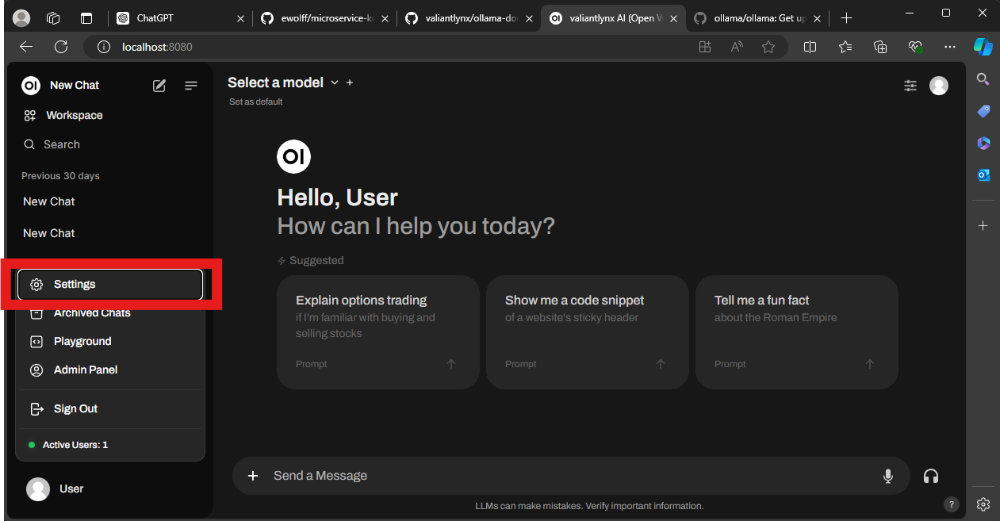
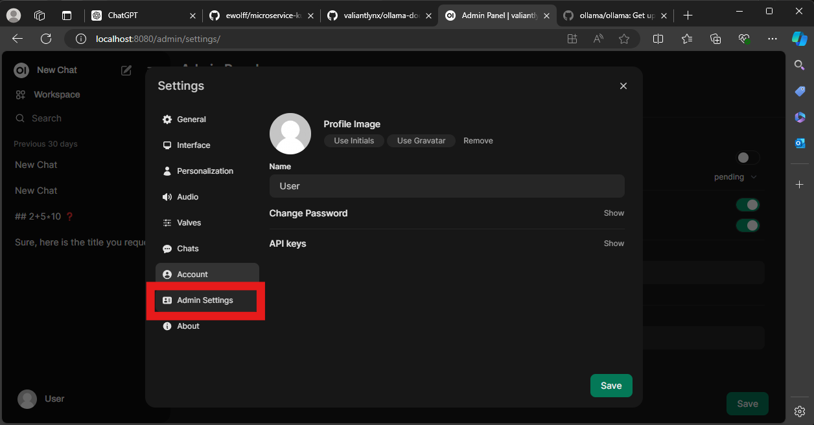
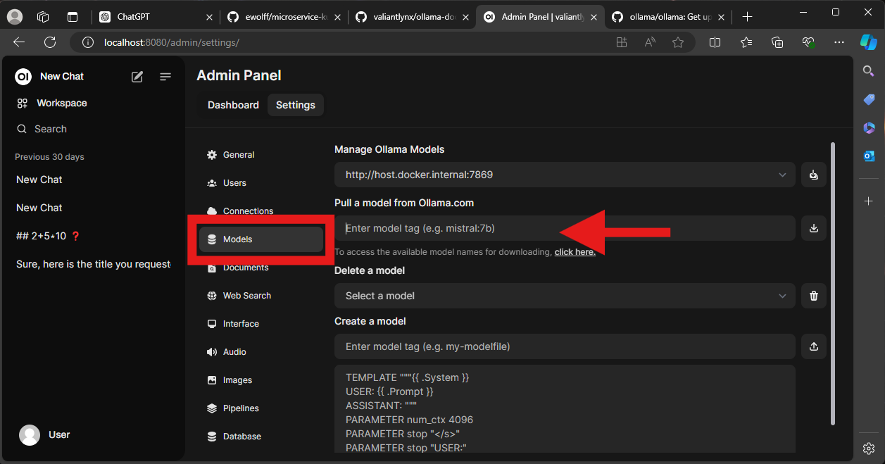
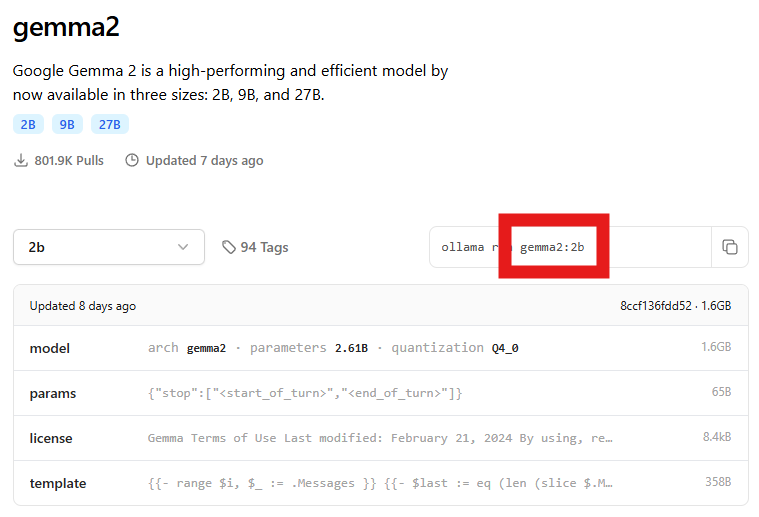

# Laborarbeit - Self-hosted LLM Chatbot

## Zielsetzung der Anwendung

Die Zielsetzung dieser Anwendung ist es, ein selbst gehostetes LLM (Large Language
Model) Chatbot-System bereitzustellen, das auf dem eigenen Rechner betrieben wird.
Das Hosting auf der eigenen Hardware gewährleistet hohe Datensicherheit und Kontrolle
über die sensiblen Informationen. Die Anwendung nutzt eine Microservices-Architektur
auf Kubernetes, um Anfragen effizient zu verarbeiten, dynamisch zu skalieren und das
System zu überwachen. Sie kann mehrere Instanzen eines Open-Source-LLMs ausführen
und die Skalierung basierend auf der Last automatisch anpassen. Zusätzlich besteht die
Möglichkeit, bei Bedarf über APIs auf LLMs von OpenAI zuzugreifen, was jedoch mit
einem potenziell geringeren Maß an Datensicherheit verbunden ist.

## Architektur


## Entwurf

Basierend OpenWebUI und Ollama Docker.
Angepasst, sodass die Anwendung persistent ist auf Kubernetes läuft und load balancing (2 deployments von Ollama)
Die Anwendung ist für lokale Deployments auf Enduser Geräten konzipiert und unterstützt entsprechend nur eine Single-User Funktionalität.
Deshalb basiert die Lösung auf einem einzelnen Minikube Node, aber mehreren Pods.

- Persistenz:
  Das Projekt verfügt über persistente Datenspeicherung für die LLMs sowie auch Chatverläufe etc. (Ordner wird automatisch lokal erstellt).
  Somit wird auch die Datenintegrität sichergestellt wenn ein Node stirbt.

- Load Balancing
  Load Balancing automatisch durch Kubernetes. NGINX ist externer LB? --> ERgänzung notwendig. Ingress Nginx notwendig da website und Weiterleitung zum Host

- Automatische Skalierung & Monitoring
  Automatische SKalierung durch Implementierung von Prometheus möglich. Aktuell dynamisch, aber manuell. Wir starten mit 2 Deployments von Ollama um eine schnelle Skalierung zu ermöglichen. Automatische Skalierung (HPA) basiert auf CPU-Auslastung.

- Single User
  Aktuell Single-User Only, da noch keine Lösung für Multi-WebUI Deployment implementiert wurde. Ist was für die Zukunft.

- Geschwindigkeit
  Ohne GPU-Support, weshalb die Geschwindigkeit entsprechend langsam ist.
-

## Start Minikube ()

Lokal-Pfad : Zielpfad

```bash
minikube start --mount-string="<Projekt_Pfad>:/c/SBX/cloud/Projekt/ollama" --mount
```

## Install Prometheus and Grafana

### Add helm repos

```bash
helm repo add prometheus-community https://prometheus-community.github.io/helm-charts
helm repo add grafana https://grafana.github.io/helm-charts
```

### Update helm repos

```bash
helm repo update
```

### Install für PV -- Jonas sein Mist

```bash
helm install grafana grafana/grafana \
 --set persistence.enabled=true \
 --set persistence.existingClaim="grafana-pvc" \
```

```bash
helm install prometheus prometheus-community/prometheus \
  --set server.persistentVolume.enabled=true \
  --set server.persistentVolume.existingClaim=prometheus-pvc \
```

### Install

```bash
helm install prometheus prometheus-community/prometheus
helm install grafana --set adminPassword=admin grafana/grafana
```

### Anleitung aus der Vorlesung:

https://farberg.de/talks/cloud/?03d%20-%20Monitoring%20and%20Scalability.md#/5

## Enable Metrics Server

```bash
minikube addons enable metrics-server
```

## Start Ollama and Open-Webui

```bash
kubectl apply -k ./kubernetes
```

## Port forward

Jeden Port-Forward in einem neuen Terminal starten, sodass alle parallel laufen.

```bash
kubectl port-forward svc/prometheus-server 8888:80
kubectl port-forward svc/grafana 9999:80
kubectl port-forward svc/webui-service 7777:8080
```

### Open Prometheus

http://localhost:8888

### Open Grafana

http://localhost:9999

Login:
username: admin
password: admin

### Verbindung Grafana mit Prometheus

Nun muss Prometeus als Datenquelle in Grafana hinterlegt werden. Hierzu über Connections, Data Sources und Prometheus hinzufügen.
Hierzu den Link von Prometheus

http://prometheus-server

einfügen. Sonst alles auf default belasssen.

CPU visualization:

```bash
sum(rate(container_cpu_usage_seconds_total{pod=~"ollama-.*"}[5m])) by (pod) / sum(kube_pod_container_resource_limits{pod=~"ollama-.*"}) by (pod) * 100
```

### Open Webui

http://localhost:7777

Registrieren und anmelden.

### Download von Modell

Links unten auf Profil --> Einstellungen --> Admin --> Modelle
Ein Modell aussuchen (ggf. klein. da Performance limitiert) zb: https://ollama.com/library (46MB)
Name kopieren
Einfügen, downloaden

und loslegen

## Minikube stoppen

```bash
minikube stop
```

## Mnikube löschen

```bash
minikube delete
```

# Installation eine Models

Dieses Projekt beinhaltet keine installierten Modelle. Deshalb müssen diese initial manuell installiert werden. Die Modelle werden persistent unter dem Pfad ./ollama/ollama gespeichert, sodass sie nur ein Mal installiert werden müssen.

Dazu muss wie folgt navigiert werden:  
Settings -> Admin Setting -> Models

Dort muss wie in den Bildern beschrieben ein Model Ollama.com herausgesucht werden.





